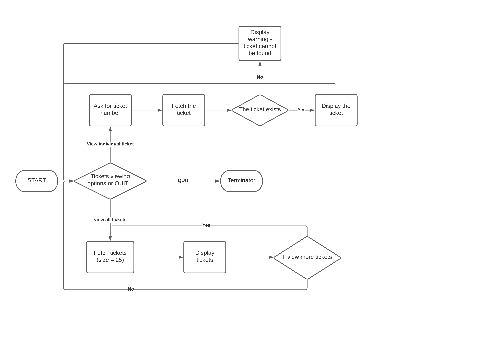

# zendesk-ticket-viewer
This Zendesk Ticket Viewer project is for Zendesk Internship Coding Challenge

## How to run app
`ruby lib/app.rb`

## How to run test
`rspec`

## Implemention details
The goal of this challenge is to write a ticket viewer which allows the user to view their tickets.

There are four requirements of this project:
1. Connect to the Zendesk API via user email address and password.
2. Parse JSON data returned by Zendesk API to get all the tickets from the user account.
3. Display them in a list.
4. View individual ticket details.

The MVC pattern (Model, View, and Controller) is used in this app.

1. Model: `models/ticket.rb`, this code can hold raw data of ticket.
2. View: `views/ticket_view.rb` and `views/tickets_view.rb` are made up of functions that display tickets data to user.
3. Controller: `controllers/ticket_controller.rb` acts as a liaison between the Model and the View, fetching data and deciding what to display.
It’s the brains of the application, and ties together the model and the view.
4. There are few other classes:
  - `app.rb` is the main entry point of this app.
  - `router.rb` controls the menus display and interactions with the user.
  - `ticket_gateway.rb` is responsible for user verification and make API call.

## What can be improved
### Performance
Currently, offsets pagination is used, which will fetch one page, 25 tickets per page, at one time.
But the app is fetching data whenever it has been called.
However, if one page has been fetched, supposedly can be stored in memory to avoid multiple API calls.

### Security
There is a security risk, as user email and token for API authentication are stored in the app and pushed to GitHub.
Should be a way to encrypt the email and token.

### Testing
Only did unit tests and manual tests, but no auto integration test.


## Flowchart



## Interface
Here is how this should work, when running `ruby lib/app.rb`:

1. User options menu -
```
*** Welcome to the Zendesk Ticker Viewer ***
Choose your options? (Press ↑/↓ arrow to move and Enter to select)
‣ 1. View all tickets
  2. View a ticket
  3. Quit
```
2. View all tickets (display one page, 25 tickets, in one table)
```
*** Welcome to the Zendesk Ticker Viewer ***
Choose your options? 1. View all tickets
+----+-----------------------------------------------+--------------+----------------------+----------+
| id | subject                                       | requester_id | created_at           | priority |
+----+-----------------------------------------------+--------------+----------------------+----------+
| 1  | Sample ticket: Meet the ticket                | 902096546763 | 2021-05-04T01:44:29Z | normal   |
| 2  | I need help                                   | 902096546763 | 2021-05-04T01:48:33Z | normal   |
| 3  | velit eiusmod reprehenderit officia cupidatat | 902096545123 | 2021-05-04T12:08:35Z | N/A      |
| 4  | excepteur laborum ex occaecat Lorem           | 902096545123 | 2021-05-04T12:08:36Z | N/A      |
| 5  | ad sunt qui aute ullamco                      | 902096545123 | 2021-05-04T12:08:37Z | N/A      |
| 6  | aliquip mollit quis laborum incididunt        | 902096545123 | 2021-05-04T12:08:38Z | N/A      |
| 7  | nisi aliquip ipsum nostrud amet               | 902096545123 | 2021-05-04T12:08:39Z | N/A      |
| 8  | cillum quis nostrud labore amet               | 902096545123 | 2021-05-04T12:08:39Z | N/A      |
| 9  | proident est nisi non irure                   | 902096545123 | 2021-05-04T12:08:40Z | N/A      |
| 10 | veniam ea eu minim aute                       | 902096545123 | 2021-05-04T12:08:41Z | N/A      |
| 11 | magna reprehenderit nisi est cillum           | 902096545123 | 2021-05-04T12:08:42Z | N/A      |
| 12 | quis veniam ad sunt non                       | 902096545123 | 2021-05-04T12:08:42Z | N/A      |
| 13 | tempor aliquip sint dolore incididunt         | 902096545123 | 2021-05-04T12:08:43Z | N/A      |
| 14 | labore pariatur ut laboris laboris            | 902096545123 | 2021-05-04T12:08:44Z | N/A      |
| 15 | officia mollit aliqua eu nostrud              | 902096545123 | 2021-05-04T12:08:45Z | N/A      |
| 16 | do incididunt incididunt quis anim            | 902096545123 | 2021-05-04T12:08:45Z | N/A      |
| 17 | tempor magna anim ea id                       | 902096545123 | 2021-05-04T12:08:46Z | N/A      |
| 18 | exercitation sit incididunt magna laboris     | 902096545123 | 2021-05-04T12:08:47Z | N/A      |
| 19 | laborum ea ut in cupidatat                    | 902096545123 | 2021-05-04T12:08:48Z | N/A      |
| 20 | est fugiat labore pariatur esse               | 902096545123 | 2021-05-04T12:08:48Z | N/A      |
| 21 | commodo sint laboris est et                   | 902096545123 | 2021-05-04T12:08:49Z | N/A      |
| 22 | laboris sint Lorem ex Lorem                   | 902096545123 | 2021-05-04T12:08:50Z | N/A      |
| 23 | esse adipisicing consectetur sunt tempor      | 902096545123 | 2021-05-04T12:08:51Z | N/A      |
| 24 | sunt enim pariatur id id                      | 902096545123 | 2021-05-04T12:08:51Z | N/A      |
| 25 | et ad ut enim labore                          | 902096545123 | 2021-05-04T12:08:52Z | N/A      |
+----+-----------------------------------------------+--------------+----------------------+----------+
```
3. View more tickets - First page tickets menu
```
Choose your tickets viewing options? (Press ↑/↓ arrow to move and Enter to select)
✘ 1. View previous page (This is the first page.)
‣ 2. View next page
  3. Return to Menu
```
4. View more tickets - Tickets menu
```
Choose your tickets viewing options? (Press ↑/↓ arrow to move and Enter to select)
‣ 1. View previous page
  2. View next page
  3. Return to Menu
```
5. View more tickets - Last page tickets menu
```
Choose your tickets viewing options? (Press ↑/↓ arrow to move and Enter to select)
‣ 1. View previous page
✘ 2. View next page (This is the last page.)
  3. Return to Menu
```
6. View a ticket
```
Choose your options? 2. View a ticket
Enter ticket number: 1
Ticket Details
id: 1
type: incident
subject: Sample ticket: Meet the ticket
description: Hi Lacy,

This is your first ticket. Ta-da! Any customer request sent to your supported channels (email, chat, voicemail, web form, and tweet) will become a Support ticket, just like this one. Respond to this ticket by typing a message and clicking Submit. You can also see how an email becomes a ticket by emailing your new account, support@lacyzhang.zendesk.com. Your ticket will appear in ticket views.

That's the ticket on tickets. If you want to learn more, check out:
https://support.zendesk.com/hc/en-us/articles/203691476

created_at: 2021-05-04T01:44:29Z
updated_at: 2021-05-04T01:44:30Z
status: open
```
7. Ending app - goodbye message
```
Choose your options? 3. Quit
Thank you for using Zendesk Ticket Viewer. Goodbye.
```
